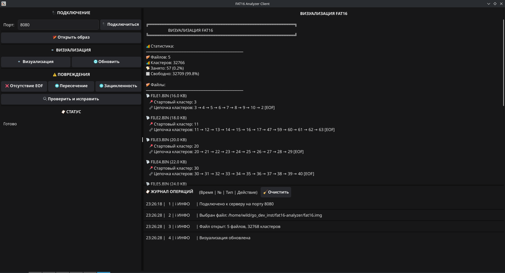

# FAT16 Analyzer

## 📚 О проекте

**Курсовой проект** по дисциплинам «ОС» и «ВССиТ».

### Требования из ТЗ:
- Реализовать клиент-серверное приложение на TCP
- Разработать собственный протокол обмена (без HTTP/WebSocket)
- Ядро ФС оформить как динамически подключаемую библиотеку (.so)
- Обеспечить работу с FAT16 на уровне байтов (без готовых парсеров)
- GUI для демонстрации работы

### Технические особенности (обоснованные ТЗ):
- **CGo + shared library** — динамическая подгрузка ядра ФС
- **TCP + gob** — кастомный протокол с фреймингом сообщений
- **Побайтовый парсинг** — работа с boot sector, FAT, root directory
- **Fyne GUI** — кроссплатформенный клиент без внешних зависимостей

> ⚠️ Проект **учебный**, выполнен в рамках курсового задания. Код оптимизирован для понимания, не для production.

[](https://go.dev/)
[](https://pkg.go.dev/cmd/cgo)
[](https://fyne.io/)
[](LICENSE)

**Инструмент для низкоуровневого анализа, повреждения и восстановления файловых систем FAT16.**

Проект работает напрямую с бинарной структурой диска: boot sector, FAT таблица, кластеры, записи директорий. Это не высокоуровневый CRUD, а работа с файловой системой на байтовом уровне.

> Курсовой проект студента 3 курса СПбГТИ(ТУ), направление «Информатика и вычислительная техника»

---

## Скриншот графического интерфейса

<p align="center">
  
</p>

---

## Возможности

- Анализ FAT16: чтение boot sector, парсинг FAT таблицы, восстановление дерева файлов
- Просмотр цепочек кластеров (как файлы физически разбросаны по диску)
- Создание повреждений трёх типов: обрыв EOF, пересечение кластеров, зацикливание
- Автоматическое восстановление: поиск и исправление ошибок
- Текстовая визуализация структуры диска
- GUI на Fyne (окно с кнопками и логом операций)
- Клиент-серверная архитектура: удалённая работа через TCP

---

## Что в проекте интересного (технически)

Работа с реальной ФС низкого уровня:
- Побайтовый парсинг boot-сектора, вычисление параметров (размер кластера, количество FAT, зарезервированные сектора)
- Чтение и модификация FAT-таблицы (16 бит)
- Восстановление цепочек кластеров для каждого файла, включая обработку циклов и пересечений

Автоматическое восстановление после повреждений:
- Поиск кластеров без маркера конца файла (EOF)
- Обнаружение кластеров, на которые ссылаются несколько файлов (пересечения)
- Детекция зацикленных цепочек кластеров
- Исправление без потери данных (обрезание цепочек, переназначение ссылок)

CGo и сборка:
- Go-обёртка над C-библиотекой для низкоуровневой работы с дисковыми образами
- Сборка в shared library и статическое связывание

Клиент-сервер:
- TCP-сервер с конкурентной обработкой запросов (sync.RWMutex)
- Сериализация через gob, свой протокол поверх TCP
- GUI-клиент на Fyne, который подключается к серверу

---

## Технологии

- Go 1.21 — сервер, клиент, CGo обёртка
- C (fat16.h) — базовая библиотека работы с FAT16
- Fyne — кроссплатформенный GUI
- TCP + gob — протокол обмена
- Bash — скрипты сборки и создания тестовых образов

---

## Быстрый старт

Сборка и запуск (всё в одном репозитории):

```bash
# 1. Собрать всё
./scripts/build-all.sh

# 2. Создать тестовый образ FAT16 с файлами
./scripts/create_fat16.sh

# 3. Запустить сервер (в одном терминале)
./run.sh server 8080

# 4. Запустить клиент (в другом терминале)
./run.sh client
```

## В клиенте

1. Укажите порт `8080`
2. Нажмите «Подключиться»
3. Откройте созданный образ `fat16.img` (или свой)


## Структура проекта
```
fat16-analyzer/
├── lib/      # C библиотека и CGo обёртка
├── server/   # TCP сервер
├── client/   # GUI на Fyne
├── scripts/  # Скрипты сборки и создания образа
├── run.sh    # Универсальный запуск
└── fat16.img # Тестовый образ (создаётся скриптом)
```
## Лицензия

MIT

## 📫 Контакты

<p align="left">
  <a href="https://t.me/wildsergunys"></a>
  <a href="mailto:quoqy@mail.ru"></a>
</p>
